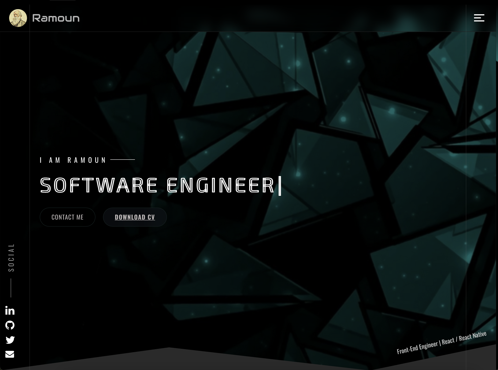
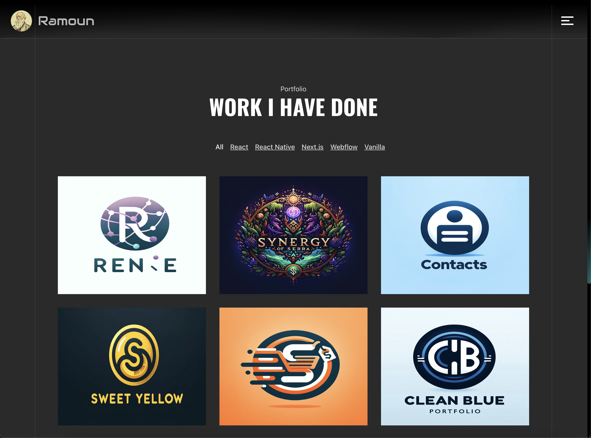
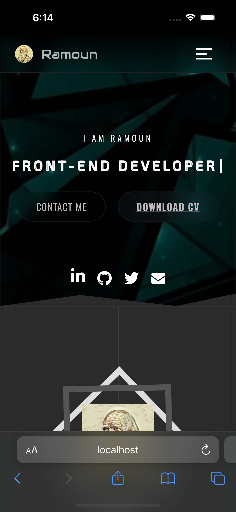
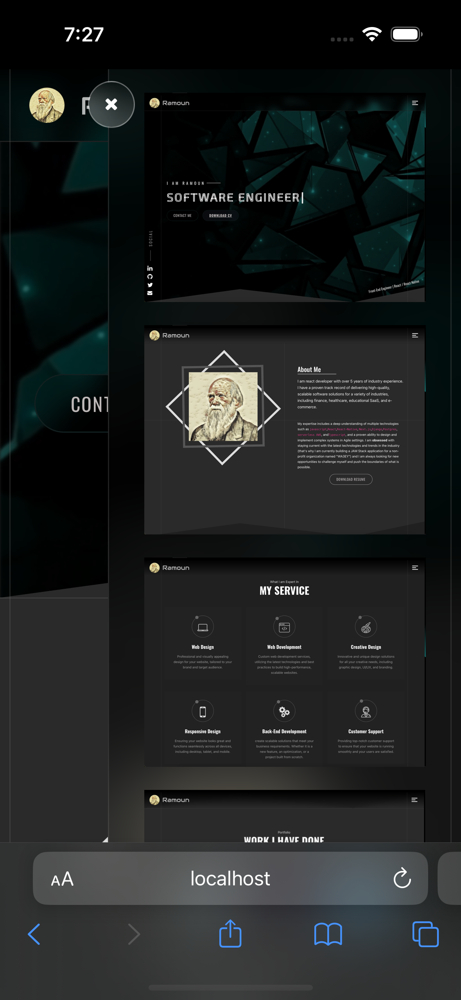
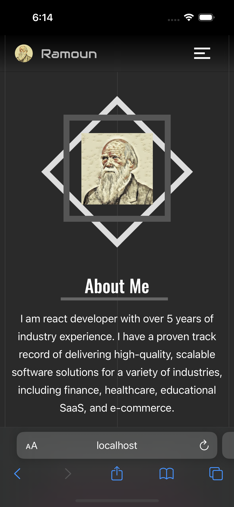

# Ana Fayrouz

> A Software Engineer Portfolio App Made with React, React-Router, and Bootstrap. The Project Contains a Showcase with Information About Me, All of My Works (Apps), and a Contact Form for Communication.The app includes a range of customizable components such as project cards, skill tags, and contact forms, that create a unique and engaging portfolio website that stands out from the crowd.

## A Screenshot of the Homepage

## Collective Screenshots of the Mobile Version

  
  
  
  

## A Demo for the App

- [Demo](https://anafayrouz.omarramoun.com/)

## Built With

- Languages: _**JS/ES6**_
- Framework: _**React, Redux, Styled-Components, React-Router**_
- Technologies used: _**GIT, GITHUB, LINTERS**_

## Authors

👤 **Ramoun**

- **GitHub**: 
- **Twitter**: 
- **LinkdIn**: 

## 🤝 Contributing

Contributions, issues, and feature requests are welcome!

Feel free to check the [issues page](../../issues).

## Show your support

Give a ⭐️ if you like this project!
